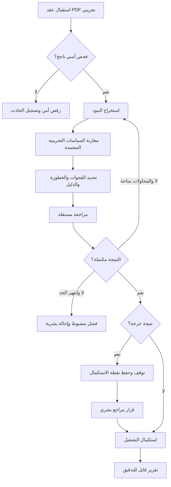

# Vendor Contract Compliance Audit Agent
# وكيل تدقيق عقود الموردين والامتثال المؤسسي

مشروع تخرج ضمن برنامج **Advanced Agentic AI Systems Engineering** في **SDAIA Academy — August 2026**.

> **الحالة الحالية:** Phase 1 — Foundation and evaluation traceability.

## المشكلة

تستغرق مراجعة عقود الموردين مقابل السياسات المؤسسية وقتًا، وقد يصعب تتبع الدليل الذي بُني عليه كل استنتاج. يهدف المشروع مستقبلًا إلى مساعدة المراجع في تحليل **عقود وسياسات تجريبية مصطنعة فقط**، وربط فجوات الامتثال بالبند والسياسة والدليل، وتقديم نتيجة قابلة للتدقيق.

## القرار الحاكم وحدود الصلاحية

هذا المشروع **نظام دعم قرار تجريبي، وليس رأيًا قانونيًا ولا نظامًا قانونيًا إنتاجيًا**. لا يملك النظام صلاحية اعتماد عقد أو رفضه تلقائيًا. عند وجود نتائج حرجة، يجب أن يتوقف ويطلب قرار مراجع بشري مخوّل. المراجع البشري مسؤول عن القرار النهائي، ولا تحل مخرجات النظام محل الاستشارة القانونية أو إجراءات المؤسسة.

لا تنفّذ المرحلة الحالية تحليلًا بالذكاء الاصطناعي أو سير عمل تشغيليًا؛ ما يرد أدناه تصميم وخطة مستقبلية فقط.

## سيناريو العمل المستقبلي

1. استقبال عقد مورد بصيغة PDF.
2. فحص الملف أمنيًا قبل معالجة محتواه.
3. استخراج بنود العقد في بنية محددة.
4. مقارنة البنود مع سياسات تجريبية معتمدة.
5. تحديد الفجوات ودرجة الخطورة والدليل المرتبط بها.
6. مراجعة النتائج بواسطة وكيل مستقل.
7. إعادة التحليل عند نقص النتيجة، ضمن حد أقصى معلوم للمحاولات.
8. التوقف لطلب اعتماد بشري عند النتائج الحرجة.
9. استكمال التشغيل من نقطة محفوظة وإصدار تقرير قابل للتدقيق.

## أدوار الوكلاء المخطط لها

- **Orchestrator:** يدير الخطة والحالة والتوجيه والتوقف والاستكمال.
- **Contract Analyst:** يستخرج البنود والأدلة من العقد غير الموثوق.
- **Compliance Analyst:** يقارن البنود بالسياسات التجريبية المعتمدة ويصنف الفجوات.
- **Independent Reviewer:** يتحقق بصورة مستقلة من اكتمال النتائج واتساق أدلتها.

## الأهداف الهندسية المخططة

جميع العناصر التالية **مخططة وليست منفذة في Phase 1**:

- Plan-and-Execute.
- Real tool calls.
- LangGraph StateGraph.
- Conditional routing.
- Bounded retry.
- Multi-agent structured state.
- Guardrails.
- Prompt-injection testing.
- Redaction.
- Tracing and metrics.
- SQLite checkpoint persistence.
- Human-in-the-loop interrupt/resume.
- FastAPI.
- Docker Compose.

تفاصيل التصميم في [المعمارية](docs/architecture.md)، وتتبع متطلبات التقييم في [مصفوفة التقييم](docs/evaluation-matrix.md)، وحدود الأمان في [وثيقة الأمان](docs/security-boundaries.md)، وخطة التنفيذ في [خارطة الطريق](docs/roadmap.md). ستُحفظ أدلة التنفيذ المستقبلية وفق [دليل مجلد evidence](evidence/README.md).

## الفريق

- **قائد الفريق:** Salman Abid
- **GitHub:** [salman1-source](https://github.com/salman1-source)
- سيُضاف أعضاء الفريق الآخرون بعد تأكيدهم.

## تنبيه حماية البيانات

**يُمنع رفع العقود السرية، أو البيانات الشخصية، أو السياسات الداخلية السرية، أو مفاتيح API والإنتاج إلى هذا المستودع.** استخدم بيانات مصطنعة وقيمًا تجريبية فقط، ولا تضع أسرارًا فعلية في `.env.example` أو السجل أو أدلة التشغيل.
